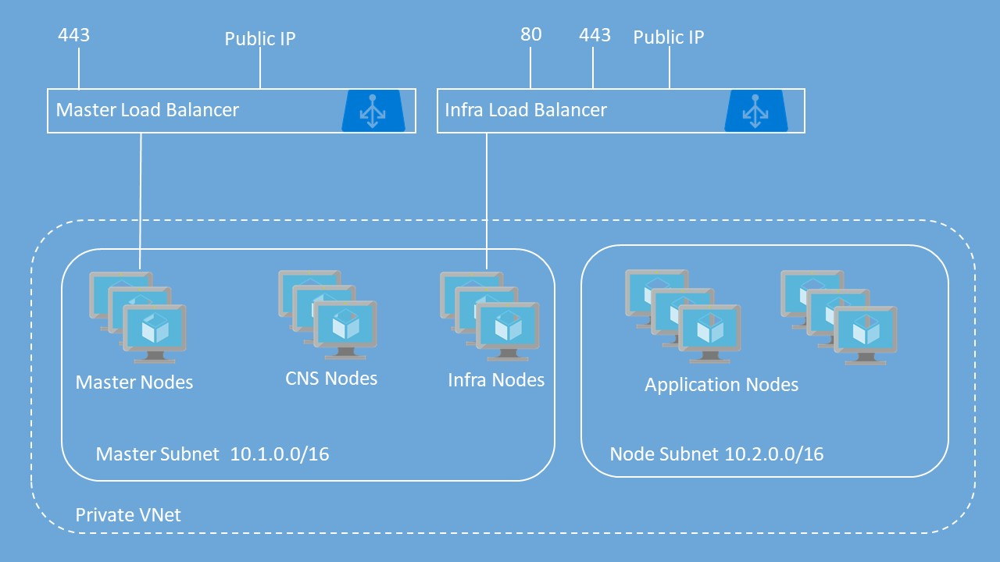

# OpenShift Container Platform Deployment Template

## NOTE: Structure of Repo

**The Master branch has been updated to deploy version 3.10**

The master branch contains the most current release of OpenShift Container Platform with experimental items.  This may cause instability but will include new items or enable new configuration options.

We have branches for the stable releases:
- Release-3.6 (As is; no longer updated)
- Release-3.7
- Release-3.9
- azurestack-release-3.7
- azurestack-release-3.9

Bookmark [aka.ms/OpenShift](http://aka.ms/OpenShift) for future reference.

**For OpenShift Origin refer to https://github.com/Microsoft/openshift-origin**

## OpenShift Container Platform 3.10 with Username / Password authentication for OpenShift

1.  Single master option available
2.  VM types that support Accelerated Networking will automatically have this feature enabled
3.  Custom and existing Vnet
4.  Support cluster with private masters (no public IP on load balancer in front of master nodes)
5.  Support cluster with private router (no public IP on load balancer in front of infra nodes)
6.  Support broker pool ID along with compute pool ID
7.  Support for default gallery RHEL On Demand image and 3rd party Marketplace offer

This template deploys OpenShift Container Platform with basic username / password for authentication to OpenShift. It includes the following resources:

|Resource           	|Properties                                                                                                                          |
|-----------------------|------------------------------------------------------------------------------------------------------------------------------------|
|Virtual Network <br />Default  		|**Address prefix:** 10.0.0.0/14<br />**Master subnet:** 10.1.0.0/16<br />**Node subnet:** 10.2.0.0/16                      |
|Virtual Network <br />Custom   		|**Address prefix:** Your Choice<br />**Master subnet:** Your Choice<br />**Node subnet:** Your Choice                      |
|Master Load Balancer	|1 probe and 1 rule for TCP 443                                       |
|Infra Load Balancer	|2 probes and 2 rules for TCP 80 and TCP 443									                                           |
|Public IP Addresses	|Bastion Public IP for Bastion Node<br />OpenShift Master public IP attached to Master Load Balancer (if masters are public)<br />OpenShift Router public IP attached to Infra Load Balancer (if router is public)           |
|Storage Accounts <br />Unmanaged Disks  	|1 Storage Account for Bastion VM <br />1 Storage Account for Master VMs <br />1 Storage Account for Infra VMs<br />2 Storage Accounts for Node VMs<br />2 Storage Accounts for Diagnostics Logs <br />1 Storage Account for Private Docker Registry<br />1 Storage Account for Persistent Volumes  |
|Storage Accounts <br />Managed Disks      |2 Storage Accounts for Diagnostics Logs <br />1 Storage Account for Private Docker Registry |
|Network Security Groups|1 Network Security Group for Bastion VM<br />1 Network Security Group Master VMs<br />1 Network Security Group for Infra VMs<br />1 Network Security Group for Node VMs |
|Availability Sets      |1 Availability Set for Master VMs<br />1 Availability Set for Infra VMs<br />1 Availability Set for Node VMs  |
|Virtual Machines   	|1 Bastion Node - Used to Run Ansible Playbook for OpenShift deployment<br />1, 3 or 5 Master Nodes<br />1, 2 or 3 Infra Nodes<br />User-defined number of Nodes (1 to 30)<br />All VMs include a single attached data disk for Docker thin pool logical volume|



## READ the instructions in its entirety before deploying!

Additional documentation for deploying OpenShift in Azure can be found here: https://docs.microsoft.com/en-us/azure/virtual-machines/linux/openshift-get-started

This template deploys multiple VMs and requires some pre-work before you can successfully deploy the OpenShift Cluster.  If you don't complete the pre-work correctly, you will most likely fail to deploy the cluster using this template.  Please read the instructions completely before you proceed. 

This template uses the On-Demand Red Hat Enterprise Linux image from the Azure Gallery. 
>When using the On-Demand image, there is an hourly charge for using this image.  At the same time, the instance will be registered to your Red Hat subscription, so you will also be using one of your entitlements. This will lead to "double billing".

If you are only using one pool ID for all nodes, then enter the same pool ID for both 'rhsmPoolId' and 'rhsmBrokerPoolId'.

If 3rd marketplace offer is selected, then you need to provide the following informatin for the offer - publisher, offer, sku, version.  You also need to enable the offer for programatic deployment.

If private masters is selected, a static private IP needs to be specified which will be assigned to the front end of the master load balancer.  This must be within the CIDR for the master subnet and not already in use.  The master DNS name must also be supplied and this needs to map to the static Private IP and will be used to access the console on the master nodes.

If private router is selected, a static private Ip needs to be specified which will be assigned to the front end of the infra load balancer.  This must be within the CIDR for the infra subnet and not already in use.  **customSubDomainType** must be set to "custom" and the wildcard DNS name for routing must be provided for **defaultSubDomain**.

After successful deployment, the Bastion Node is the only node with a public IP that you can ssh into.  Even if the master nodes are configured for public access, they are not exposed for ssh access.

## Prerequisites

### Generate SSH Keys

You'll need to generate an SSH key pair (Public / Private) in order to provision this template. Ensure that you do **NOT** include a passphrase with the private key. <br/><br/>
If you are using a Windows computer, you can download puttygen.exe.  You will need to export to OpenSSH (from Conversions menu) to get a valid Private Key for use in the Template.<br/><br/>
From a Linux or Mac, you can just use the ssh-keygen command.  Once you are finished deploying the cluster, you can always generate new keys that uses a passphrase and replace the original ones used during initial deployment.

### Create Key Vault to store SSH Private Key

You will need to create a Key Vault to store your SSH Private Key that will then be used as part of the deployment.  This extra work is to provide security around the Private Key - especially since it does not have a passphrase.  I recommend creating a Resource Group specifically to store the KeyVault.  This way, you can reuse the KeyVault for other deployments and you won't have to create this every time you chose to deploy another OpenShift cluster.

**Create Key Vault using Azure CLI 2.0**<br/>
1.  Create new Resource Group: az group create -n \<name\> -l \<location\><br/>
    Ex: `az group create -n ResourceGroupName -l 'East US'`<br/>
1.  Create Key Vault: az keyvault create -n \<vault-name\> -g \<resource-group\> -l \<location\> --enabled-for-template-deployment true<br/>
    Ex: `az keyvault create -n KeyVaultName -g ResourceGroupName -l 'East US' --enabled-for-template-deployment true`<br/>
1.  Create Secret: az keyvault secret set --vault-name \<vault-name\> -n \<secret-name\> --file \<private-key-file-name\><br/>
    Ex: `az keyvault secret set --vault-name KeyVaultName -n SecretName --file ~/.ssh/id_rsa`<br/>

### Generate Azure Active Directory (AAD) Service Principal

To configure Azure as the Cloud Provider for OpenShift Container Platform, you will need to create an Azure Active Directory Service Principal.  The easiest way to perform this task is via the Azure CLI.  Below are the steps for doing this.

Assigning permissions to the entire Subscription is the easiest method but does give the Service Principal permissions to all resources in the Subscription.  Assigning permissions to only the Resource Group is the most secure as the Service Principal is restricted to only that one Resource Group. 
   
**Azure CLI 2.0**

1. **Create Service Principal and assign permissions to Subscription**<br/>
  a.  az ad sp create-for-rbac -n \<friendly name\> --password \<password\> --role contributor --scopes /subscriptions/\<subscription_id\><br/>
      Ex: `az ad sp create-for-rbac -n openshiftcloudprovider --password Pass@word1 --role contributor --scopes /subscriptions/555a123b-1234-5ccc-defgh-6789abcdef01`<br/>

2. **Create Service Principal and assign permissions to Resource Group**<br/>
  a.  If you use this option, you must have created the Resource Group first.  Be sure you don't create any resources in this Resource Group before deploying the cluster.<br/>
  b.  az ad sp create-for-rbac -n \<friendly name\> --password \<password\> --role contributor --scopes /subscriptions/\<subscription_id\>/resourceGroups/\<Resource Group Name\><br/>
      Ex: `az ad sp create-for-rbac -n openshiftcloudprovider --password Pass@word1 --role contributor --scopes /subscriptions/555a123b-1234-5ccc-defgh-6789abcdef01/resourceGroups/00000test`<br/>

3. **Create Service Principal without assigning permissions to Resource Group**<br/>
  a.  If you use this option, you will need to assign permissions to either the Subscription or the newly created Resource Group shortly after you initiate the deployment of the cluster or the post installation scripts will fail when configuring Azure as the Cloud Provider.<br/>
  b.  az ad sp create-for-rbac -n \<friendly name\> --password \<password\> --role contributor --skip-assignment<br/>
      Ex: `az ad sp create-for-rbac -n openshiftcloudprovider --password Pass@word1 --role contributor --skip-assignment`<br/>

You will get an output similar to:

```javascript
{
  "appId": "2c8c6a58-44ac-452e-95d8-a790f6ade583",
  "displayName": "openshiftcloudprovider",
  "name": "http://openshiftcloudprovider",
  "password": "Pass@word1",
  "tenant": "12a345bc-1234-dddd-12ab-34cdef56ab78"
}
```

The appId is used for the aadClientId parameter.


### Red Hat Subscription Access

For security reasons, the method for registering the RHEL system allows the use of an Organization ID and Activation Key as well as a Username and Password. Please know that it is more secure to use the Organization ID and Activation Key.

You can determine your Organization ID by running ```subscription-manager identity``` on a registered machine.  To create or find your Activation Key, please go here: https://access.redhat.com/management/activation_keys.

You will also need to get the Pool ID that contains your entitlements for OpenShift.  You can retrieve this from the Red Hat portal by examining the details of the subscription that has the OpenShift entitlements.  Or you can contact your Red Hat administrator to help you.

### azuredeploy.Parameters.json File Explained
| Property                          | Description                                                                                                                                                                                                                                                                                                                                          | Valid options                                                                        | Default value |
|-----------------------------------|------------------------------------------------------------------------------------------------------------------------------------------------------------------------------------------------------------------------------------------------------------------------------------------------------------------------------------------------------|--------------------------------------------------------------------------------------|---------------|
| `_artifactsLocation`              | URL for artifacts (json, scripts, etc.)                                                                                                                                                                                                                                                                                                              |                                                                                      |               |
| `masterVmSize`                    | Size of the Master VM. Select from one of the allowed VM sizes listed in the azuredeploy.json file                                                                                                                                                                                                                                                   |                                                                                      |               |
| `infraVmSize`                     | Size of the Infra VM. Select from one of the allowed VM sizes listed in the azuredeploy.json file                                                                                                                                                                                                                                                    |                                                                                      |               |
| `nodeVmSize`                      | Size of the App Node VM. Select from one of the allowed VM sizes listed in the azuredeploy.json file                                                                                                                                                                                                                                                 |                                                                                      |               |
| `cnsVmSize`                       | Size of the CNS Node VM. Select from one of the allowed VM sizes listed in the azuredeploy.json file                                                                                                                                                                                                                                                 |                                                                                      |               |
| `osImageType`                     | The RHEL image to use.                                                                                                                                                                                                                                                                                                                               | "defaultgallery" (On-Demand RHEL)<br><br>"marketplace" (3rd party Marketplace image) |               |
| `marketplaceOsImage`              | If `osImageType` is marketplace, then enter the appropriate values for 'publisher', 'offer', 'sku', 'version' of the marketplace offer. This is an object type                                                                                                                                                                                       |                                                                                      |               |
| `storageKind`                     | The type of storage to be used.                                                                                                                                                                                                                                                                                                                      | - "managed"<br>- "unmanaged"                                                         |               |
| `openshiftClusterPrefix`          | Cluster Prefix used to configure hostnames for all nodes - bastion, master, infra and app nodes. Between 1 and 20 characters                                                                                                                                                                                                                         |                                                                                      |               |
| `masterInstanceCount`             | Number of Masters nodes to deploy                                                                                                                                                                                                                                                                                                                    |                                                                                      |               |
| `infraInstanceCount`              | Number of infra nodes to deploy                                                                                                                                                                                                                                                                                                                      |                                                                                      |               |
| `nodeInstanceCount`               | Number of Nodes to deploy                                                                                                                                                                                                                                                                                                                            |                                                                                      |               |
| `dataDiskSize`                    | Size of data disk to attach to nodes for Docker volume                                                                                                                                                                                                                                                                                               | - 32 GB<br>- 64 GB<br>- 128 GB<br>- 256 GB<br>- 512 GB<br>- 1024 GB<br>- 2048 GB     |               |
| `adminUsername`                   | Admin username for both OS (VM) login and initial OpenShift user                                                                                                                                                                                                                                                                                     |                                                                                      |               |
| `openshiftPassword`               | Password for OpenShift user and root user                                                                                                                                                                                                                                                                                                            |                                                                                      |               |
| `enableMetrics`                   | Enable Metrics                                                                                                                                                                                                                                                                                                                                       | - "true"<br>- "false"                                                                |               |
| `enableLogging`                   | Enable Logging                                                                                                                                                                                                                                                                                                                                       | - "true"<br>- "false"                                                                |               |
| `enableCNS`                       | Enable Container Native Storage (CNS)                                                                                                                                                                                                                                                                                                                | - "true"<br>- "false"                                                                |               |
| `rhsmUsernameOrOrgId`             | Red Hat Subscription Manager Username or Organization ID. To find your Organization ID, run on registered server `subscription-manager identity`.                                                                                                                                                                                                    |                                                                                      |               |
| `rhsmPasswordOrActivationKey`     | Red Hat Subscription Manager Password or Activation Key for your Cloud Access subscription. You can get this from [here](https://access.redhat.com/management/activation_keys).                                                                                                                                                                      |                                                                                      |               |
| `rhsmPoolId`                      | The Red Hat Subscription Manager Pool ID that contains your OpenShift entitlements for compute nodes                                                                                                                                                                                                                                                 |                                                                                      |               |
| `rhsmBrokerPoolId`                | The Red Hat Subscription Manager Pool ID that contains your OpenShift entitlements for masters and infra nodes. If you don't have different pool IDs, then enter the same pool ID as 'rhsmPoolId'                                                                                                                                                    |                                                                                      |               |
| `sshPublicKey`                    | Copy your SSH Public Key here                                                                                                                                                                                                                                                                                                                        |                                                                                      |               |
| `keyVaultResourceGroup`           | The name of the Resource Group that contains the Key Vault                                                                                                                                                                                                                                                                                           |                                                                                      |               |
| `keyVaultName`                    | The name of the Key Vault you created                                                                                                                                                                                                                                                                                                                |                                                                                      |               |
| `keyVaultSecret`                  | The Secret Name you used when creating the Secret (that contains the Private Key)                                                                                                                                                                                                                                                                    |                                                                                      |               |
| `enableAzure`                     | Enable Azure Cloud Provider                                                                                                                                                                                                                                                                                                                          | - "true"<br>- "false"                                                                |               |
| `aadClientId`                     | Azure Active Directory Client ID also known as Application ID for Service Principal                                                                                                                                                                                                                                                                  |                                                                                      |               |
| `aadClientSecret`                 | Azure Active Directory Client Secret for Service Principal                                                                                                                                                                                                                                                                                           |                                                                                      |               |
| `defaultSubDomainType`            | This will either be nipio (if you don't have your own domain) or custom if you have your own domain that you would like to use for routing                                                                                                                                                                                                           |                                                                                      |               |
| `defaultSubDomain`                | The wildcard DNS name you would like to use for routing if you selected custom above.  If you selected nipio above, you must still enter something here but it will not be used                                                                                                                                                                      |                                                                                      |               |
| `virtualNetworkNewOrExisting`     | Select whether to use an existing Virtual Network or create a new Virtual Network                                                                                                                                                                                                                                                                    | - "existing"<br>- "new"                                                              |               |
| `virtualNetworkResourceGroupName` | The name of the Resource Group where the VNet resides. If creating a new VNet, this needs to be the name of the Resource Group that the cluster is being deployed to. If this parameter is omitted, it will default to RG in which new resources are created                                                                                         |                                                                                      |               |
| `virtualNetworkName`              | The name of the Virtual Network. Must match the existing name for existing VNet or the name of the new VNet to create if creating a new VNet                                                                                                                                                                                                         |                                                                                      |               |
| `masterSubnetName`                | The name of the Master Subnet                                                                                                                                                                                                                                                                                                                        |                                                                                      |               |
| `nodeSubnetName`                  | The name of the Node Subnet <br>**NOTE:** For the next three IP ranges they need to be in CIDR format and be in RFC 1918 (10.0.0.0/8, 192.168.0.0/16, or 172.16.0.0/12) <br>**NOTE:** The range just can't put servers in the 10.128.0.0/16 range but it can be a larger subnet that includes them like 10.0.0.0/8                                   |                                                                                      |               |
| `addressPrefixes`                 | IP range for the entire Virtual Network.                                                                                                                                                                                                                                                                                                             |                                                                                      | 10.0.0.0/14   |
| `masterSubnetPrefix`              | Subnet for master, CNS, and infra nodes to be hosted. Needs to have enough IPs to support the number of nodes being deployed.                                                                                                                                                                                                                        |                                                                                      | 10.1.0.0/16   |
| `nodeSubnetPrefix`                | Subnet for applicaton nodes. Needs to have enough IPs to support the number of nodes being deployed.                                                                                                                                                                                                                                                 |                                                                                      | 10.2.0.0/16   |
| `masterClusterType`               | Specify whether the cluster uses private or public master nodes. If private is chosen, the master nodes will not be exposed to the Internet via a public IP. Instead, it will use the private IP specified in the next parameter.                                                                                                                    | - "public"<br>- "private"                                                            | public        |
| `masterPrivateClusterIp`          | If private master nodes is selected, then a private IP address must be specified for use by the internal load balancer for master nodes. This will be a static IP so it must reside within the CIDR block for the master subnet and not already in use. If public master nodes is selected, this value will not be used but must still be specified. |                                                                                      | 10.1.0.200    |
| `masterPrivateClusterDns`         | If private master nodes is selected, then a DNS name (FQDN) must be specified. This maps to the private IP address specified in the previous parameter                                                                                                                                                                                               |                                                                                      |               |
| `routerClusterType`               | Specify whether the cluster uses private or public infra nodes. If private is chosen, the infra nodes will not be exposed to the Internet via a public IP. Instead, it will use the private IP specified in the next parameter.                                                                                                                      | - "public"<br>- "private"                                                            | public        |
| `routerPrivateClusterIp`          | If private infra nodes is selected, then a private IP address must be specified for use by the internal load balancer for infra nodes. This will be a static IP so it must reside within the CIDR block for the master subnet and not already in use. If public infra nodes is selected, this value will not be used but must still be specified.    |                                                                                      | 10.1.0.201    |


## Deploy Template

Deploy to Azure using Azure Portal: 
<a href="https://portal.azure.com/#create/Microsoft.Template/uri/https%3A%2F%2Fraw.githubusercontent.com%2FMicrosoft%2Fopenshift-container-platform%2Fmaster%2Fazuredeploy.json" target="_blank"></a>
<a href="https://portal.azure.us/#create/Microsoft.Template/uri/https%3A%2F%2Fraw.githubusercontent.com%2FMicrosoft%2Fopenshift-container-platform%2Fmaster%2Fazuredeploy.json" target="_blank"></a>
<a href="http://armviz.io/#/?load=https%3A%2F%2Fraw.githubusercontent.com%2FMicrosoft%2Fopenshift-container-platform%2Fmaster%2Fazuredeploy.json" target="_blank"></a>
<br/>

Once you have collected all of the prerequisites for the template, you can deploy the template by clicking Deploy to Azure or populating the **azuredeploy.parameters.json** file and executing Resource Manager deployment commands with PowerShell or the Azure CLI.

**Azure CLI 2.0**

1. Create Resource Group: az group create -n \<name\> -l \<location\><br />
Ex: `az group create -n openshift-cluster -l westus`
2. Create Resource Group Deployment: az group deployment create --name \<deployment name\> --template-file \<template_file\> --parameters @\<parameters_file\> --resource-group \<resource group name\> --nowait<br />
Ex: `az group deployment create --name ocpdeployment --template-file azuredeploy.json --parameters @azuredeploy.parameters.json --resource-group openshift-cluster --no-wait`


### NOTE

The OpenShift Ansible playbook does take a while to run when using VMs backed by Standard Storage. VMs backed by Premium Storage are faster. If you want Premium Storage, select a DS, Es, or GS series VM.  It is highly recommended that Premium storage be used.
<hr />

If the Azure Cloud Provider is not enabled, then the Service Catalog and Ansible Template Service Broker will not be installed as Service Catalog requires persistent storage.

Be sure to follow the OpenShift instructions to create the necessary DNS entry for the OpenShift Router for access to applications. <br />

A Standard Storage Account is provisioned to provide persistent storage for the integrated OpenShift Registry as Premium Storage does not support storage of anything but VHD files.


### TROUBLESHOOTING

If you encounter an error during deployment of the cluster, please view the deployment status.  The following Error Codes will help to narrow things down.

1.  Exit Code 3:  Your Red Hat Subscription User Name / Password or Organization ID / Activation Key is incorrect
2.  Exit Code 4:  Your Red Hat Pool ID is incorrect or there are no entitlements available
3.  Exit Code 5:  Unable to provision Docker Thin Pool Volume
4.  Exit Code 99: Configuration playbooks were not downloaded

You can SSH to the Bastion node and from there SSH to each of the nodes in the cluster and fix the issues.

A common cause for the failures related to the node service not starting is the Service Principal did not have proper permissions to the Subscription or the Resource Group.  If this is indeed the issue, then assign the correct permissions and manually re-run the script that failed an all subsequent scripts.  Be sure to restart the service that failed (e.g. systemctl restart atomic-openshift-node.service) before executing the scripts again.

For further troubleshooting, please SSH into your Bastion node on port 22.  You will need to be root **(sudo su -)** and then navigate to the following directory: **/var/lib/waagent/custom-script/download**<br/><br/>
You should see a folder named '0' and '1'.  In each of these folders, you will see two files, stderr and stdout.  You can look through these files to determine where the failure occurred.

## Post-Deployment Operations

### Service Catalog

**Service Catalog**

If you enable Azure or CNS for storage these scripts will deploy the service catalog as a post deployment option.

### Metrics and logging

**Metrics**

If you deployed Metrics, it will take a few extra minutes deployment to complete. Please be patient.

Once the deployment is complete, log into the OpenShift Web Console and complete an addition configuration step.  Go to the openshift-infra project, click on Hawkster metrics route, and accept the SSL exception in your browser.

**Logging**

If you deployed Logging, it will take a few extra minutes deployment to complete. Please be patient.

Once the deployment is complete, log into the OpenShift Web Console and complete an addition configuration step.  Go to the logging project, click on the Kubana route, and accept the SSL exception in your browser.

### Creation of additional users

To create additional (non-admin) users in your environment, login to your master server(s) via SSH and run:
<br><i>htpasswd /etc/origin/master/htpasswd mynewuser</i>

### Additional OpenShift Configuration Options
 
You can configure additional settings per the official (<a href="https://docs.openshift.com/container-platform/3.10/welcome/index.html" target="_blank">OpenShift Enterprise Documentation</a>).
