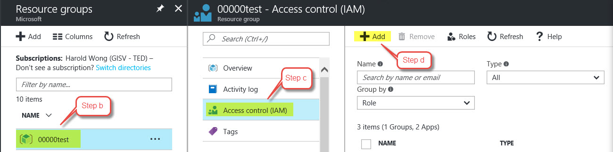
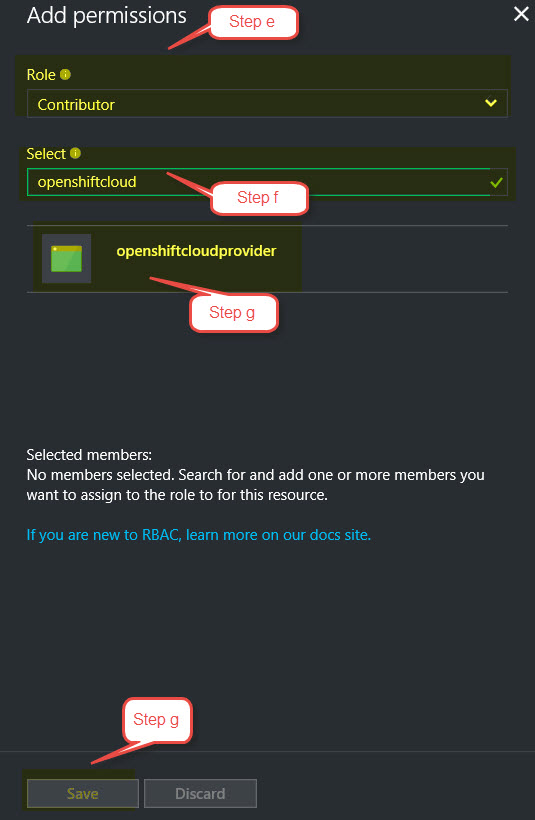
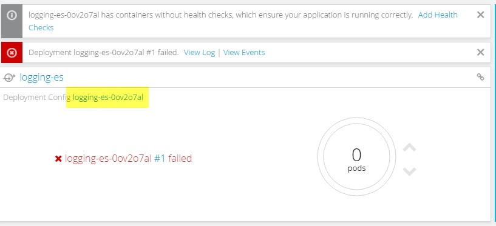
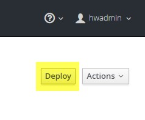

# OpenShift Container Platform Deployment Template

Bookmark [aka.ms/OpenShift](http://aka.ms/OpenShift) for future reference.

**For OpenShift Origin refer to https://github.com/Microsoft/openshift-origin**

## OpenShift Container Platform 3.5 with Username / Password authentication for OpenShift

This template deploys OpenShift Container Platform with basic username / password for authentication to OpenShift. It includes the following resources:

|Resource           	|Properties                                                                                                                          |
|-----------------------|------------------------------------------------------------------------------------------------------------------------------------|
|Virtual Network   		|**Address prefix:** 10.0.0.0/8<br />**Master subnet:** 10.1.0.0/16<br />**Node subnet:** 10.2.0.0/16                      |
|Master Load Balancer	|2 probes and 2 rules for TCP 8443 and TCP 9090 <br/> NAT rules for SSH on Ports 2200-220X                                           |
|Infra Load Balancer	|3 probes and 3 rules for TCP 80, TCP 443 and TCP 9090 									                                             |
|Public IP Addresses	|Bastion Public IP for Bastion Node<br />OpenShift Master public IP attached Master Load Balancer<br />OpenShift Router public IP attached to Infra Load Balancer            |
|Storage Accounts   	|1 Storage Account for Masters <br />1 Storage Accounts for Infra VMs and Bastion VM<br />2 Storage Accounts for Node VMs<br />1 Storage Account for Private Docker Registry<br />2 Storage Accounts for Persistent Volumes  |
|Network Security Groups|1 Network Security Group Master VMs<br />1 Network Security Group for Infra VMs<br />1 Network Security Group for Node VMs<br />1 Network Security Group for Bastion VM  |
|Availability Sets      |1 Availability Set for Master VMs<br />1 Availability Set for Infra VMs<br />1 Availability Set for Node VMs  |
|Virtual Machines   	|1 Bastion Node - Used to Run Ansible Playbook for OpenShift deployment<br />1, 2, or 3 Masters<br />1, 2, or 3 Infra nodes<br />User-defined number of nodes (1 to 30)<br />All VMs include a single attached data disk for Docker thin pool logical volume|


## READ the instructions in its entirety before deploying!

This template deploys multiple VMs and requires some pre-work before you can successfully deploy the OpenShift Cluster.  If you don't get the pre-work done correctly, you will most likely fail to deploy the cluster using this template.  Please read the instructions completely before you proceed. 

This template allows you to choose between a custom VHD image in an existing Storage Account or the On-Demand Red Hat Enterprise Linux image from the Azure Gallery. 
>If you use the On-Demand image, there is an hourly charge for using this image.  At the same time, the instance will be registered to your Red Hat subscription so you will also be using one of your entitlements. This will lead to "double billing".

After successful deployment, the Bastion Node is no longer required unless you want to use it to add nodes or run other playbooks in the future.  You can turn it off and delete it or keep it around for running future playbooks.

## Prerequisites

### Generate SSH Keys

You'll need to generate an SSH key pair (Public / Private) in order to provision this template. Ensure that you do **NOT** include a passphrase with the private key. <br/><br/>
If you are using a Windows computer, you can download puttygen.exe.  You will need to export to OpenSSH (from Conversions menu) to get a valid Private Key for use in the Template.<br/><br/>
From a Linux or Mac, you can just use the ssh-keygen command.  Once you are finished deploying the cluster, you can always generate new keys that uses a passphrase and replace the original ones used during inital deployment.

### Create Key Vault to store SSH Private Key

You will need to create a Key Vault to store your SSH Private Key that will then be used as part of the deployment.  This extra work is to provide security around the Private Key - especially since it does not have a passphrase.  I recommend creating a Resource Group specifically to store the KeyVault.  This way, you can reuse the KeyVault for other deployments and you won't have to create this every time you chose to deploy another OpenShift cluster.

1. Create KeyVault using Powershell <br/>
  a.  Create new resource group: `New-AzureRMResourceGroup -Name 'ResourceGroupName' -Location 'West US'`<br/>
  b.  Create key vault: `New-AzureRmKeyVault -VaultName 'KeyVaultName' -ResourceGroup 'ResourceGroupName' -Location 'West US'`<br/>
  c.  Create variable with sshPrivateKey: `$securesecret = ConvertTo-SecureString -String '[copy ssh Private Key here - including line feeds]' -AsPlainText -Force`<br/>
  d.  Create Secret: `Set-AzureKeyVaultSecret -Name 'SecretName' -SecretValue $securesecret -VaultName 'KeyVaultName'`<br/>
  e.  Enable for Template Deployment: `Set-AzureRMKeyVaultAccessPolicy -VaultName 'KeyVaultName' -ResourceGroupName 'ResourceGroupName' -EnabledForTemplateDeployment`<br/>

2. **Create Key Vault using Azure CLI 1.0**<br/>
  a.  Create new Resource Group: azure group create \<name\> \<location\><br/>
         Ex: `azure group create ResourceGroupName 'East US'`<br/>
  b.  Create Key Vault: azure keyvault create -u \<vault-name\> -g \<resource-group\> -l \<location\><br/>
         Ex: `azure keyvault create -u KeyVaultName -g ResourceGroupName -l 'East US'`<br/>
  c.  Create Secret: azure keyvault secret set -u \<vault-name\> -s \<secret-name\> --file \<private-key-file-name\><br/>
         Ex: `azure keyvault secret set -u KeyVaultName -s SecretName --file ~/.ssh/id_rsa`<br/>
  d.  Enable the Keyvvault for Template Deployment: azure keyvault set-policy -u \<vault-name\> --enabled-for-template-deployment true<br/>
         Ex: `azure keyvault set-policy -u KeyVaultName --enabled-for-template-deployment true`<br/>

3. **Create Key Vault using Azure CLI 2.0**<br/>
  a.  Create new Resource Group: az group create -n \<name\> -l \<location\><br/>
         Ex: `az group create -n ResourceGroupName -l 'East US'`<br/>
  b.  Create Key Vault: az keyvault create -n \<vault-name\> -g \<resource-group\> -l \<location\> --enabled-for-template-deployment true<br/>
         Ex: `az keyvault create -n KeyVaultName -g ResourceGroupName -l 'East US' --enabled-for-template-deployment true`<br/>
  c.  Create Secret: az keyvault secret set --vault-name \<vault-name\> -n \<secret-name\> --file \<private-key-file-name\><br/>
         Ex: `az keyvault secret set --vault-name KeyVaultName -n SecretName --file ~/.ssh/id_rsa`<br/>

### Generate Azure Active Directory (AAD) Service Principal

To configure Azure as the Cloud Provider for OpenShift Container Platform, you will need to create an Azure Active Directory Service Principal.  The easiest way to perform this task is via the Azure CLI.  Below are the steps for doing this.

You will want to create the Resource Group that you will ultimately deploy the OpenShift cluster to prior to completing the following steps.  If you don't, then wait until you initiate the deployment of the cluster before completing **Azure CLI 1.0 Step 2**. If using **Azure CLI 2.0**, complete step 2 to create the Service Principal prior to deploying the cluster and then assign permissions based on **Azure CLI 1.0 Step 2**.
 
**Azure CLI 1.0**

1. **Create Service Principal**<br/>
  a.  azure ad sp create -n \<friendly name\> -p \<password\> --home-page \<URL\> --identifier-uris \<URL\><br/>
      Ex: `azure ad sp create -n openshiftcloudprovider -p Pass@word1 --home-page http://myhomepage --identifier-uris http://myhomepage`

The entries for --home-page and --identifier-uris is not important for this use case so they do not have to be valid links.
You will get an output similar to this

```
info:    Executing command ad sp create
+ Creating application openshift demo cloud provider
+ Creating service principal for application 198c4803-1236-4c3f-ad90-46e5f3b4cd2a
data:    Object Id:               00419334-174b-41e8-9b83-9b5011d8d352
data:    Display Name:            openshiftcloudprovider
data:    Service Principal Names:
data:                             198c4803-1236-4c3f-ad90-46e5f3b4cd2a
data:                             http://myhomepage
info:    ad sp create command OK
```
Save the Object Id and the GUID in the Service Principal Names section.  This GUID is the Application ID / Client ID (aadClientId parameter).  The the password you entered as part of the CLI command is the input the aadClientSecret paramter.

2. **Assign permissions to Service Principal for specific Resource Group**<br/>
  a.  Sign into the Azure Portal<br/>
  b.  Select the Resource Group you want to assign permissions to<br/>
  c.  Select Access control (IAM) from middle pane<br/>
  d.  Click Add on right pane<br/>
  e.  For Role, Select Contributor<br/>
  f.  In Select field, type the name of your Service Principal to find it<br/>
  g.  Click the Service Principal from the list and hit Save<br/>




  
**Azure CLI 2.0**

1. **Create Service Principal and assign permissions to Resource Group**<br/>
  a.  az ad sp create-for-rbac -n \<friendly name\> --password \<password\> --role contributor --scopes /subscriptions/\<subscription_id\>/resourceGroups/\<Resource Group Name\><br/>
      Ex: `az ad sp create-for-rbac -n openshiftcloudprovider --password Pass@word1 --role contributor --scopes /subscriptions/555a123b-1234-5ccc-defgh-6789abcdef01/resourceGroups/00000test`<br/>

2. **Create Service Principal without assigning permissions to Resource Group**<br/>
  a.  az ad sp create-for-rbac -n \<friendly name\> --password \<password\> --role contributor --skip-assignment<br/>
      Ex: `az ad sp create-for-rbac -n openshiftcloudprovider --password Pass@word1 --role contributor --skip-assignment`<br/>

You will get an output similar to:

```javascript
{
  "appId": "2c8c6a58-44ac-452e-95d8-a790f6ade583",
  "displayName": "openshiftcloudprovider",
  "name": "http://openshiftcloudprovider",
  "password": "Pass@word1",
  "tenant": "12a345bc-1234-dddd-12ab-34cdef56ab78"
}
```

The appId is used for the aadClientId parameter.

To assign permissions, please follow the instructions from Azure CLI 1.0 Step 2 above.

### Red Hat Subscription Access

For security reasons, the method for registering the RHEL system has been changed to allow the use of an Organization ID and Activation Key as well as a Username and Password. Please know that it is more secure to use the Organization ID and Activation Key.

You can determine your Organization ID by running ```subscription-manager identity``` on a registered machine.  To create or find your Activation Key, please go here: https://access.redhat.com/management/activation_keys.

You will also need to get the Pool ID that contains your entitlements for OpenShift.  You can retrieve this from the Red Hat portal by examining the details of the subscription that has the OpenShift entitlements.  Or you can contact your Red Hat administrator to help you.

### azuredeploy.Parameters.json File Explained

1.  _artifactsLocation: URL for artifacts (json, scripts, etc.)
2.  customVhdOrGallery: Choose to use a custom VHD image or an image from the Azure Gallery. The valid inputs are "gallery" or "custom". The default is set to "gallery".
2.  customStorageAccount: The URL to the storage account that contains your custom VHD image. Include the ending '/'. If "gallery" is chosen above, this parameter will not be used. Example: https://customstorageaccount.blob.core.windows.net/
2.  customOsDiskName: The folder and name of the custom VHD image. If "gallery" is chosen above, this parameter will be not be used. Example: images/customosdisk.vhd
2.  masterVmSize: Size of the Master VM. Select from one of the allowed VM sizes listed in the azuredeploy.json file
3.  infraVmSize: Size of the Infra VM. Select from one of the allowed VM sizes listed in the azuredeploy.json file
3.  nodeVmSize: Size of the Node VM. Select from one of the allowed VM sizes listed in the azuredeploy.json file
4.  openshiftClusterPrefix: Cluster Prefix used to configure hostnames for all nodes - bastion, master, infra and nodes. Between 1 and 20 characters.
5.  openshiftMasterPublicIpDnsLabel: A unique Public DNS host name (not FQDN) to reference the Master Node by
6.  infraLbPublicIpDnsLabel: A unique Public DNS host name (not FQDN) to reference the Node Load Balancer by.  Used to access deployed applications
7.  masterInstanceCount: Number of Masters nodes to deploy
8.  infraInstanceCount: Number of infra nodes to deploy
8.  nodeInstanceCount: Number of Nodes to deploy
9.  dataDiskSize: Size of data disk to attach to nodes for Docker volume - valid sizes are 128 GB, 512 GB and 1023 GB
10. adminUsername: Admin username for both OS (VM) login and initial OpenShift user
11. openshiftPassword: Password for OpenShift user and root user
11. enableMetrics: Enable Metrics - value is either "true" or "false"
11. enableLogging: Enable Logging - value is either "true" or "false"
11. enableCockpit: Enable Cockpit - value is either "true" or "false"
12. rhsmUsernamePasswordOrActivationKey: Choose to use Username and Password or Organization ID and Activation Key for registration. Valid values are "usernamepassword" and "activationkey".
12. rhsmUsernameOrOrgId: Red Hat Subscription Manager Username or Organization ID. If usernamepassword selected in previous input, then use Username; otherwise entier Organization ID. To find your Organization ID, run on registered server: `subscription-manager identity`.
13. rhsmPasswordOrActivationKey: Red Hat Subscription Manager Password or Activation Key for your Cloud Access subscription. You can get this from [here](https://access.redhat.com/management/activation_keys).
14. rhsmPoolId: The Red Hat Subscription Manager Pool ID that contains your OpenShift entitlements
15. sshPublicKey: Copy your SSH Public Key here
16. keyVaultResourceGroup: The name of the Resource Group that contains the Key Vault
17. keyVaultName: The name of the Key Vault you created
18. keyVaultSecret: The Secret Name you used when creating the Secret (that contains the Private Key)
18. aadClientId: Azure Active Directory Client ID also known as Application ID for Service Principal
18. aadClientSecret: Azure Active Directory Client Secret for Service Principal
19. defaultSubDomainType: This will either be xipio (if you don't have your own domain) or custom if you have your own domain that you would like to use for routing
20. defaultSubDomain: The wildcard DNS name you would like to use for routing if you selected custom above.  If you selected xipio above, you must still enter something here but it will not be used

## Deploy Template

Deploy to Azure using Azure Portal: 
<a href="https://portal.azure.com/#create/Microsoft.Template/uri/https%3A%2F%2Fraw.githubusercontent.com%2FMicrosoft%2Fopenshift-container-platform%2Fmaster%2Fazuredeploy.json" target="_blank"></a>
<a href="http://armviz.io/#/?load=https%3A%2F%2Fraw.githubusercontent.com%2FMicrosoft%2Fopenshift-container-platform%2Fmaster%2Fazuredeploy.json" target="_blank">
    
</a><br/>

Once you have collected all of the prerequisites for the template, you can deploy the template by clicking Deploy to Azure or populating the **azuredeploy.parameters.json** file and executing Resource Manager deployment commands with PowerShell or the Azure CLI.

**Azure CLI 1.0**

1. Create Resource Group: azure group create \<name\> \<location\><br />
Ex: `azure group create openshift-cluster westus`
2. Create Resource Group Deployment: azure group deployment create --name \<deployment name\> --template-file \<template_file\> -e \<parameters_file\> --resource-group \<resource group name\> --nowait<br />
Ex: `azure group deployment create --name ocpdeployment --template-file azuredeploy.json -e azuredeploy.parameters.json --resource-group openshift-cluster --nowait`

**Azure CLI 2.0**

1. Create Resource Group: az group create -n \<name\> -l \<location\><br />
Ex: `az group create -n openshift-cluster -l westus`
2. Create Resource Group Deployment: az group deployment create --name \<deployment name\> --template-file \<template_file\> --parameters @\<parameters_file\> --resource-group \<resource group name\> --nowait<br />
Ex: `az group deployment create --name ocpdeployment --template-file azuredeploy.json --parameters @azuredeploy.parameters.json --resource-group openshift-cluster --no-wait`


### NOTE

The OpenShift Ansible playbook does take a while to run when using VMs backed by Standard Storage. VMs backed by Premium Storage are faster. If you want Premium Storage, select a DS or GS series VM.
<hr />

Be sure to follow the OpenShift instructions to create the necessary DNS entry for the OpenShift Router for access to applications. <br />

Currently there is a hiccup in the deployment of metrics and logging that will cause the deployment to take a little longer than normal.  When you look at the stdout files on the Bastion host, you will see that the installation had numerous retries for certain playbook tasks.  This is normal.

### TROUBLESHOOTING

If you encounter an error during deployment of the cluster, please view the deployment status.  The following Error Codes will help to narrow things down.

1. Exit Code 3: Your Red Hat Subscription User Name / Password or Organization ID / Activation Key is incorrect
2. Exit Code 4: Your Red Hat Pool ID is incorrect or there are no entitlements available
3. Exit Code 5: Unable to provision Docker Thin Pool Volume

For further troubleshooting, please SSH into your Bastion node on port 22.  You will need to be root **(sudo su -)** and then navigate to the following directory: **/var/lib/waagent/custom-script/download**<br/><br/>
You should see a folder named '0' and '1'.  In each of these folders, you will see two files, stderr and stdout.  You can look through these files to determine where the failure occurred.

## Post-Deployment Operations

### Metrics and logging

**Metrics**

If you deployed Metrics, it can take up to 15 minutes for Metrics to fully deploy. Please be patient.
This is due to the fact that the Azure provider is configured after the cluster is installed and Metrics needs Persistent Storage from Azure so it hangs until the deployment script completes.

You can check the status from the OpenShift Web Console or CLI by looking in the openShift-infra project.

**Logging**

If Logging is enabled, you will need to perform some post deployment steps in order to get it up and running.
If Metrics is also enabled, please wait for all the Metrics pods to come on line before completing the post installation steps for Logging.

First, log into the OpenShift Web Console and go into the logging project. Click on Deployment Config for logging-es.



Next, click on Deploy in upper right.



It will take up to 15 minutes from this point before Logging is online. You can check the status by clicking into the appropriate project (logging or openshift-infra) and checking the status of the pods. Once all the pods are online, the service is operational.

To display metrics and logs, you need to logon to OpenShift ( https://publicDNSname:8443 ) go into the logging project, click on the Kubana route and accept the SSL exception in your browser, then do the same with the Hawkster metrics route in the openshift-infra project.

### Creation of additional users

To create additional (non-admin) users in your environment, login to your master server(s) via SSH and run:
<br><i>htpasswd /etc/origin/master/htpasswd mynewuser</i>

### Access to Cockpit

If you enable Cockpit, then the password for 'root' is set to be the same as the password for the first OpenShift user.

Use user 'root' and the same password as you assigned to your OpenShift admin to login to Cockpit ( https://publicDNSname:9090 ).
   
### Additional OpenShift Configuration Options
 
You can configure additional settings per the official (<a href="https://docs.openshift.com/container-platform/3.5/welcome/index.html" target="_blank">OpenShift Enterprise Documentation</a>).
